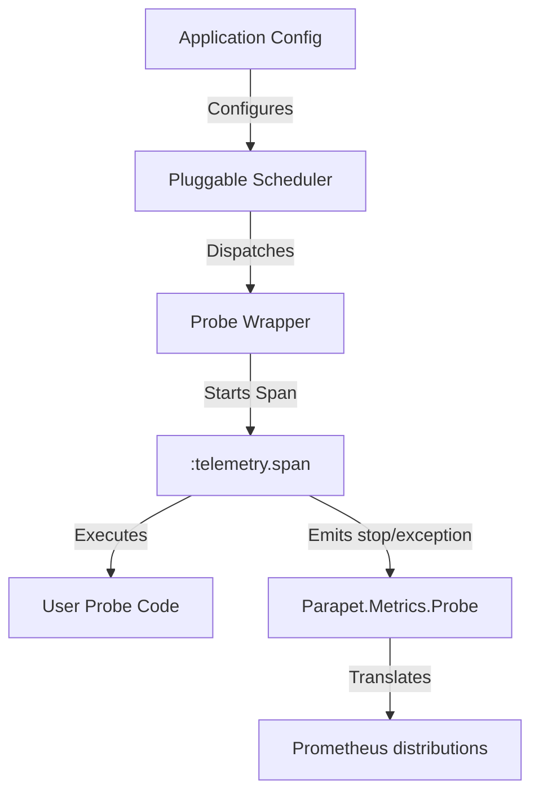

<phase_requirements>
## Phase Requirements

| ID | Description | Research Support |
|----|-------------|------------------|
| REQ-01 | Define `Parapet.Probe` behavior and macro | Confirmed `:telemetry.span/3` usage for wrapping `run/0`. |
| REQ-02 | Implement `Parapet.Probe.NativeScheduler` | Best approach is a standard GenServer using `:timer.send_interval` per probe. |
| REQ-03 | Implement `Parapet.Probe.ObanScheduler` | Requires setting `max_attempts: 1` to avoid muddying SLO stats. |
| REQ-04 | Implement `Parapet.Metrics.Probe` telemetry handler | Identified `Parapet.attach/1` as the correct dynamic registration method. |
| REQ-05 | Update configuration and documentation | Configuration must accept a `scheduler` key to flip between modes. |
</phase_requirements>

# Phase 1: Synthetic Probes - Research

**Researched:** 2024-07
**Domain:** Elixir, Telemetry, GenServer, Oban
**Confidence:** HIGH

## Summary

This phase implements synthetic probes to generate predictable traffic for SLO measurements. Probes are simply Elixir modules that wrap arbitrary business logic. The architecture introduces a pluggable scheduling system, allowing probes to be run via a simple `GenServer` timer (`NativeScheduler`) for standalone apps, or via Oban's Cron plugin (`ObanScheduler`) for durable, clustered environments.

**Primary recommendation:** Use `:telemetry.span/3` in the `Parapet.Probe` macro to ensure strictly standardized metric emission that is identical to existing core framework instrumentation, and enforce `max_attempts: 1` in the Oban worker.

## Architectural Responsibility Map

| Capability | Primary Tier | Secondary Tier | Rationale |
|------------|-------------|----------------|-----------|
| Probe Execution Wrapper | API / Backend | — | The macro ensures consistent telemetry events before yielding to user code. |
| Time-based Scheduling | API / Backend | Database | NativeScheduler uses memory timers; ObanScheduler uses PostgreSQL for distributed cron logic. |
| Metric Aggregation | API / Backend | — | `Parapet.Metrics.Probe` registers handlers to translate probe spans into Prometheus distributions. |

## Standard Stack

### Core
| Library | Version | Purpose | Why Standard |
|---------|---------|---------|--------------|
| Oban | Core | Durable Job Scheduling | Used heavily in the project; Oban Cron solves distributed scheduling. |
| Telemetry | Core | Metric standardization | Required for `[:parapet, :probe, :run]` span execution. |

## Architecture Patterns

### System Architecture Diagram



### Pattern 1: Probe Macro
**What:** The `Parapet.Probe` module using `__using__` to inject execution wrappers.
**When to use:** Whenever a developer wants to run synthetic checks.
**Example:**
```elixir
defmodule Parapet.Probe do
  defmacro __using__(_opts) do
    quote do
      @behaviour Parapet.Probe
      
      def execute do
        :telemetry.span([:parapet, :probe, :run], %{probe: inspect(__MODULE__)}, fn ->
          case run() do
            :ok -> {:ok, %{probe: inspect(__MODULE__), status: "success"}}
            {:error, reason} -> {{:error, reason}, %{probe: inspect(__MODULE__), status: "error"}}
          end
        end)
      end
    end
  end

  @callback run() :: :ok | {:error, term()}
end
```

### Pattern 2: Pluggable Scheduler
**What:** Configurable scheduler implementation.
**When to use:** To support both simple setups and clustered setups.
**Example:**
- `Parapet.Probe.NativeScheduler`: `GenServer` that takes a list of probes and intervals, scheduling them via `:timer.send_interval` or `Process.send_after`.
- `Parapet.Probe.ObanScheduler`: A generic `Oban.Worker` that receives the probe module name and invokes its `execute/0` function, triggered by Oban Cron.

## Don't Hand-Roll

| Problem | Don't Build | Use Instead | Why |
|---------|-------------|-------------|-----|
| Distributed Scheduling | GenServer + pg | Oban Cron | Cron strings and clustered execution are already solved by Oban in this stack. |
| Telemetry Events | try/rescue + :telemetry.execute | :telemetry.span/3 | Emitting start/stop/exception triplets reliably is solved by `.span/3`, mandated by codebase style. |

## Common Pitfalls

### Pitfall 1: Retrying Synthetic Probes
**What goes wrong:** Oban scheduler attempts to retry failing probes, muddying the SLO metrics by generating back-to-back failures for a single scheduled point.
**Why it happens:** Oban defaults to 20 retries for failed workers.
**How to avoid:** Hardcode `max_attempts: 1` in the generic probe Oban worker. Probes are time-series checks; a failed check is a data point, not a task to be eventually accomplished.

### Pitfall 2: High Cardinality Labels
**What goes wrong:** Prometheus runs out of memory tracking distinct metric labels.
**Why it happens:** Emitting probe paths, tokens, or dynamic IDs as labels.
**How to avoid:** `Parapet.Internal.LabelPolicy` explicitly forbids labels like `id` and `path`. Probe metrics must only use `probe` (the module name) and `status`.

## Code Examples

### Telemetry Handler Registration
```elixir
# lib/parapet/metrics/probe.ex
def setup do
  Parapet.attach(%{
    handler_id: "parapet-probe-run-stop",
    event_name: [:parapet, :probe, :run, :stop],
    handler_module: __MODULE__,
    function_name: :handle_event
  })
  
  Parapet.attach(%{
    handler_id: "parapet-probe-run-exception",
    event_name: [:parapet, :probe, :run, :exception],
    handler_module: __MODULE__,
    function_name: :handle_event
  })
end
```

## Validation Architecture

### Test Framework
| Property | Value |
|----------|-------|
| Framework | ExUnit |
| Config file | `test_helper.exs` |
| Quick run command | `mix test` |
| Full suite command | `mix test` |

### Phase Requirements → Test Map
| Req ID | Behavior | Test Type | Automated Command | File Exists? |
|--------|----------|-----------|-------------------|-------------|
| REQ-01 | `Parapet.Probe` macro wraps `run/0` with telemetry | unit | `mix test test/parapet/probe_test.exs` | ❌ Wave 0 |
| REQ-02 | `NativeScheduler` runs probes on intervals | unit | `mix test test/parapet/probe/native_scheduler_test.exs` | ❌ Wave 0 |
| REQ-03 | `ObanScheduler` delegates to probes without retries | unit | `mix test test/parapet/probe/oban_scheduler_test.exs` | ❌ Wave 0 |
| REQ-04 | `Metrics.Probe` registers and tracks distributions | unit | `mix test test/parapet/metrics/probe_test.exs` | ❌ Wave 0 |

### Wave 0 Gaps
- [ ] `test/parapet/probe_test.exs` — covers REQ-01
- [ ] `test/parapet/probe/native_scheduler_test.exs` — covers REQ-02
- [ ] `test/parapet/probe/oban_scheduler_test.exs` — covers REQ-03
- [ ] `test/parapet/metrics/probe_test.exs` — covers REQ-04

## Environment Availability

| Dependency | Required By | Available | Version | Fallback |
|------------|------------|-----------|---------|----------|
| Elixir | Framework core | ✓ | (Implied) | — |
| PostgreSQL / Oban | ObanScheduler | ✓ | (Implied) | NativeScheduler |

## Sources

### Primary (HIGH confidence)
- Codebase grep - Verified `Parapet.attach/1` setup in `Parapet.Metrics.Oban`.
- Codebase grep - Verified project-wide usage of `:telemetry.span/3` for standard instrumentation via `prompts/prior-art/rulestead-telemetry-observability-and-audit.md`.

## Metadata

**Confidence breakdown:**
- Standard stack: HIGH - Aligning exactly with existing `ObanWorker` and `LabelPolicy` setups.
- Architecture: HIGH - Fits neatly into existing metric handler plugin architecture (`Parapet.attach`).
- Pitfalls: HIGH - Oban retries and Label cardinality are well-documented concerns in this specific application.

**Research date:** 2024-07
**Valid until:** 30 days
